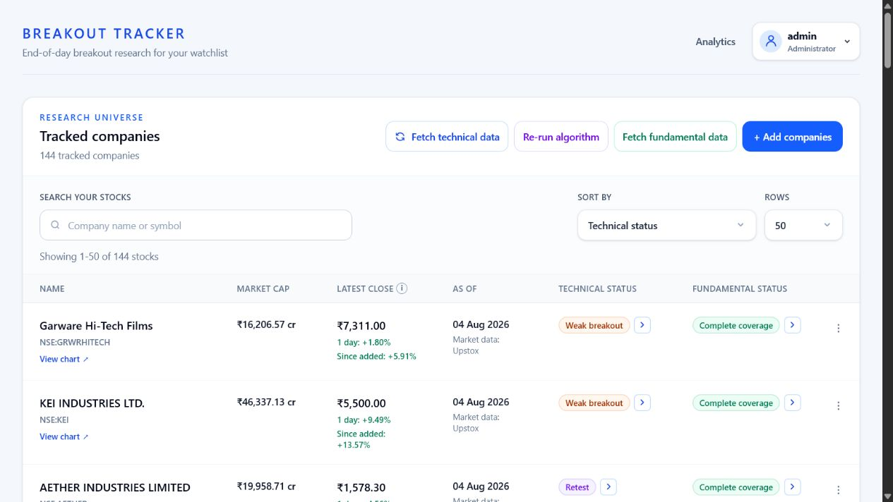
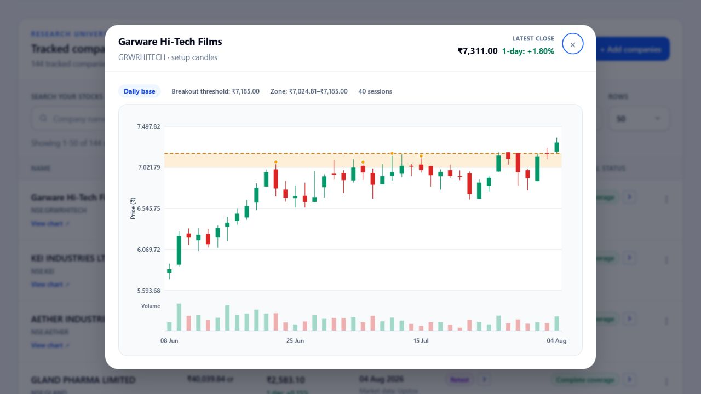
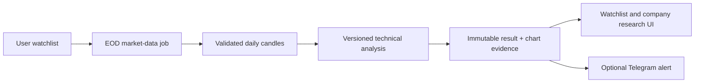

# Breakout Stocks

An explainable end-of-day research platform for NSE stocks forming or breaking
out of consolidations.


Breakout Stocks maintains a separate watchlist for each user, stores shared
market research, classifies technical setups with reproducible rules, and shows
the evidence behind each result. It is designed for personal swing and position
research—not real-time trading, order execution, or investment advice.

## Screenshots

### Watchlist research

Search, sort, and compare the latest price, setup state, data date, and
fundamental coverage for each followed company.



### Explainable setup chart

Each actionable result can include an immutable candlestick snapshot showing
the evaluated base, resistance zone, breakout threshold, and volume.



## Why this project exists

Most stock screeners return a symbol or a score without explaining the data
quality, assumptions, or rule that produced it. Breakout Stocks makes those
boundaries visible:

- every result has an explicit market date and calculation version;
- missing or stale data is reported instead of silently treated as zero;
- the current candle cannot redefine the base used to classify that candle;
- strong, weak, holding, retest, consolidating, and no-setup states are
  distinguishable;
- fundamental coverage is shown separately from technical structure; and
- historical reports avoid look-ahead bias and disclose survivorship bias.

## Key features

- Per-user authenticated watchlists with administrator and normal-user roles.
- End-of-day NSE price and volume research backed by Upstox adapters.
- Daily and weekly consolidation, resistance, breakout, holding, and retest
  analysis.
- A 0–100 setup-quality score with exposed, normalized components; it ranks
  rule quality and does not predict returns.
- Immutable analysis history and bounded chart evidence for reproducibility.
- Company fundamentals with explicit complete, partial, missing, and stale
  coverage states.
- Search, sorting, pagination, and responsive desktop/mobile presentation.
- Durable background analysis jobs with retry and stale-work recovery.
- Per-user Telegram setup-change alerts with chart evidence.
- Administrator analytics and optional Prometheus metrics.
- Synthetic snapshot data for dependable offline demos.
- Deterministic backend and frontend tests plus Docker-based CI.

## How it works



The application is a modular monolith: one FastAPI backend contains clear HTTP,
service, domain, persistence, and provider boundaries. PostgreSQL is the source
of truth; a separate worker process executes durable jobs. This keeps local
operation and interview discussion straightforward while retaining a clean path
to multiple API or worker replicas.

## Technology stack

| Layer | Technologies |
|---|---|
| Frontend | React 19, TypeScript, Vite, Tailwind CSS 4, React Router, TanStack Query, Axios |
| Backend | FastAPI, Pydantic, SQLAlchemy 2, Alembic, async Psycopg |
| Data | PostgreSQL 18, exact `Numeric`/Python `Decimal` price calculations |
| Integrations | Upstox market/fundamental data, Telegram Bot API, Prometheus metrics |
| Runtime | Docker Compose locally, GitHub Actions for CI |
| Testing | Pytest, Vitest, Testing Library, synthetic fixtures and mocked network boundaries |

## Application modes

| Mode | Purpose |
|---|---|
| `snapshot` | Read-only, deterministic interview or offline demonstration |
| `watchlist` | Live per-user research for followed companies using Upstox |
| `universe` | Future broader-universe path; not a V1 free-hosting target |

## Quick start

### Prerequisite

Install and start [Docker Desktop](https://www.docker.com/products/docker-desktop/).
Local Python and Node.js installations are not required.

### 1. Create local configuration

From the repository root in PowerShell:

```powershell
Copy-Item .env.example .env
```

Open the ignored `.env` file and replace the placeholder
`POSTGRES_PASSWORD`. Never commit this file.

### 2. Start the application

```powershell
docker compose up --build -d
docker compose exec backend alembic upgrade head
```

The services are then available at:

- Web application: <http://localhost:5173>
- API documentation: <http://localhost:8000/docs>
- Liveness check: <http://localhost:8000/health>
- Database readiness: <http://localhost:8000/ready>

### 3. Configure the administrator

Generate a password hash interactively inside the backend container:

```powershell
docker compose exec backend python -m app.scripts.generate_admin_password_hash
```

Copy the generated `ADMIN_PASSWORD_HASH_B64=...` line into `.env`, then reload
the API configuration:

```powershell
docker compose up -d --force-recreate backend
```

### 4. Optional demo data

Normal startup does not insert sample companies. For an offline demonstration,
seed the clearly synthetic fixture set:

```powershell
docker compose exec backend python -m app.scripts.seed_fixture_data
```

The fixture command is idempotent and does not require an external provider.

## Live watchlist mode

Use a read-only Upstox Analytics Token and keep it in `.env` only:

```text
APPLICATION_MODE=watchlist
UPSTOX_ACCESS_TOKEN=replace-with-your-read-only-token
```

Recreate the backend and worker after changing provider configuration:

```powershell
docker compose up -d --force-recreate backend worker
```

Signed-in users can then search NSE companies and add them to their own
watchlist. The backend revalidates every selected listing, shares stored
research across followers, and never calculates a signal from incomplete
candle history.

See the [deployment guide](docs/DEPLOYMENT.md) for the future hosted
configuration. Hosted research schedules are intentionally disabled until the
backend and database are deployed. Do not place provider credentials in
frontend environment variables.

## Verification

Run the full automated checks inside Docker:

```powershell
docker compose exec backend python -m pytest
docker compose exec frontend npm test
docker compose exec frontend npm run build
docker compose exec backend alembic check
```

Live Upstox validation is deliberately opt-in and excluded from normal CI:

```powershell
docker compose exec backend python -m app.scripts.smoke_upstox
```

## Project structure

```text
Breakout-Stocks/
├── backend/
│   ├── app/
│   │   ├── api/           # FastAPI routes and request dependencies
│   │   ├── domain/        # Pure technical analysis and backtest rules
│   │   ├── models/        # SQLAlchemy persistence models
│   │   ├── providers/     # Upstox and Telegram adapters
│   │   ├── repositories/  # Database queries and state transitions
│   │   └── services/      # Application workflows and job policies
│   ├── migrations/        # Reviewed Alembic schema migrations
│   └── tests/             # Backend unit and integration tests
├── frontend/
│   └── src/
│       ├── api/           # Shared HTTP client
│       └── features/      # Auth, stocks, watchlist, admin, and Telegram UI
├── docs/                  # Architecture, deployment, scaling, and interview notes
├── .github/workflows/     # CI and scheduled research workflows
├── compose.yaml           # Local database, API, worker, and frontend services
└── PROJECT_PLAN.md        # Product scope and architecture source of truth
```

## Engineering decisions worth discussing

- **Modular monolith:** appropriate for a personal watchlist workload and easier
  to operate than premature microservices.
- **Exact financial values:** PostgreSQL `Numeric` and Python `Decimal` avoid
  floating-point surprises in prices and derived thresholds.
- **Idempotent imports:** date uniqueness and short database transactions make
  retries safe.
- **Reproducible research:** immutable results retain algorithm, chart schema,
  candle revision, and calculation versions.
- **Honest data quality:** incomplete history, missing benchmark coverage, and
  unavailable fundamentals remain explicit states.
- **Replaceable providers:** external payloads are validated at adapter
  boundaries before reaching domain calculations.
- **Secure sessions:** HttpOnly cookies, CSRF protection, Argon2 password hashes,
  authorization-scoped reads, and backend-only credentials.

## Documentation

- [Project plan](PROJECT_PLAN.md) — product scope, rules, and milestones.
- [Architecture](docs/ARCHITECTURE.md) — runtime shape, boundaries, and data
  lifecycle.
- [Deployment](docs/DEPLOYMENT.md) — hosted PostgreSQL, Render, Vercel, and
  scheduled jobs.
- [Scaling](docs/SCALING.md) — replication, connection budgets, metrics, and
  current limits.
- [Limitations](docs/LIMITATIONS.md) — honest claims and known constraints.
- [Interview guide](docs/INTERVIEW_GUIDE.md) — walkthrough, tradeoffs, and likely
  questions.

## Security

- Secrets belong only in the ignored `.env` file or the hosting platform's
  secret store.
- `.env`, API tokens, password hashes, database volumes, and private generated
  data must never be committed.
- External provider and AI-style outputs are untrusted until their schemas and
  ranges are validated.
- Report suspected security issues privately to the repository owner instead of
  opening a public issue containing sensitive details.

## Limitations and disclaimer

This V1 is designed and tested for a personal end-of-day NSE watchlist. It is
not an intraday scanner, broker, portfolio manager, recommendation engine, or a
complete point-in-time market-universe database. Historical reports can prevent
look-ahead bias, but current-universe data still carries survivorship bias.

Market data and analysis may be delayed, incomplete, or incorrect. Nothing in
this repository is financial advice; independently verify information before
making investment decisions.

## License

This project is available under the [MIT License](LICENSE).
